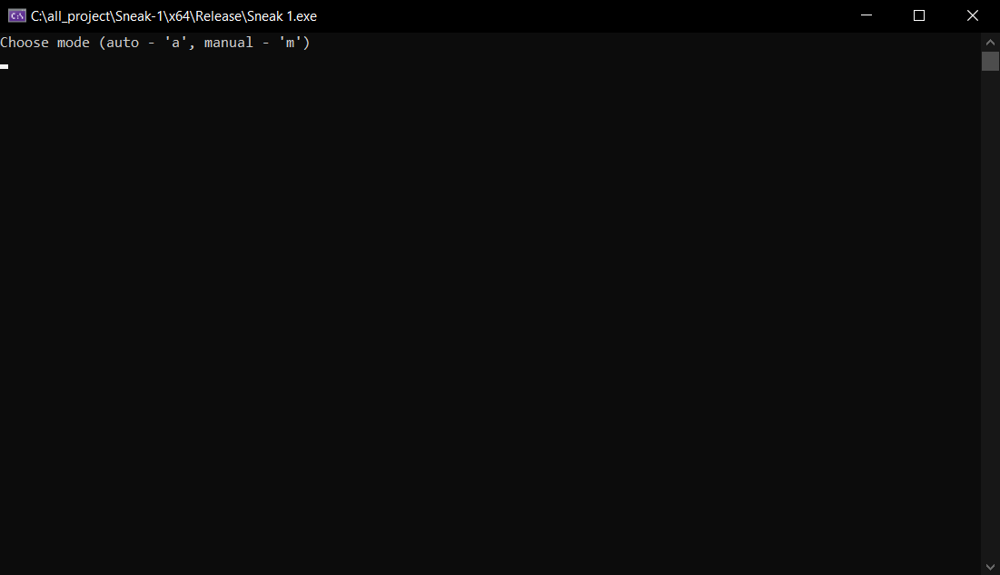
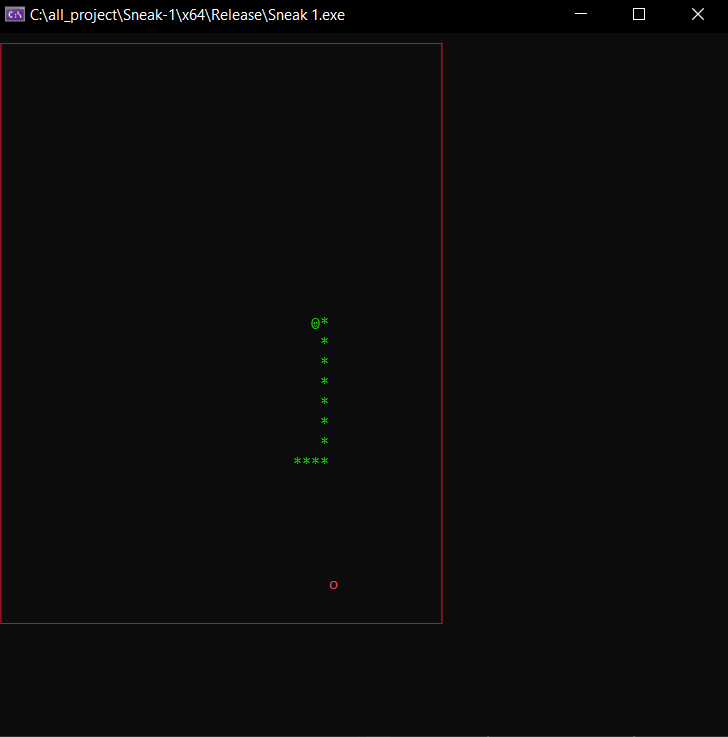
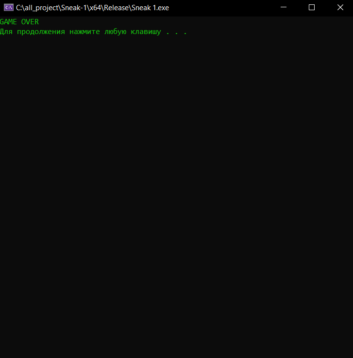

# Змейка: текстовая версия

## Описание
Этот проект представляет собой реализацию классической игры "Змейка" на языке программирования C++. Игра создана в текстовом режиме c поддержкой разных базовых цветов.
Данная версия написана почти полностью по процедурному программированию, то есть без использования классов.
Также имеется возможность выбрать два режима: автоматический, ручной. Ручной работает как и предпологается, с использованием клавишей стрелок для управления, а автоматическая версия представляет собой недоработанную версию автоматического поиска пути, очень не доработонную.

## Функционал
- Змейка может перемещаться по игровому полю, собирая еду и увеличивая свою длину.
- При попадании в стену или саму себя игра завершается.

## Скриншоты

